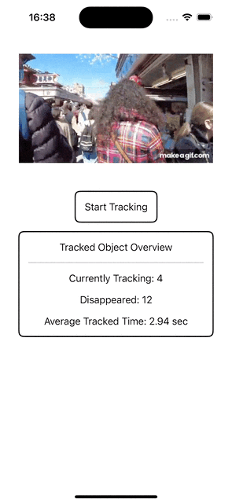

# iOS Human Tracker

Tracking human traffic in real time using Vision framework. 
A preview of the camera together with the following data displayed.
- The number of object currently tracked
- Disappeared object count
- Average time in second that an object is tracked.

Ability to set the following parameters.
- **FPS for processing**: When set to 0, processing continuously
- **Max Disappeared Frame Count**: If an object is not detected for a frame count greater this value, will be considered as disappeared.
- **Max Normalized Distance**: If the centroid of 2 detected objects in 2 consecutive frames is larger than this value, they will be considered as different objects

For further detail, please refer to [Swift/iOS: Real Time Human Traffic Tracker]().

## Prerequisite to Run
- [Xcode 16 beta](https://developer.apple.com/download)
- iOS 18 running on real device.

## Demo
A demo can be found in [TrackingDemoView](./ItsukiTracker/View/TrackingDemoView.swift).

